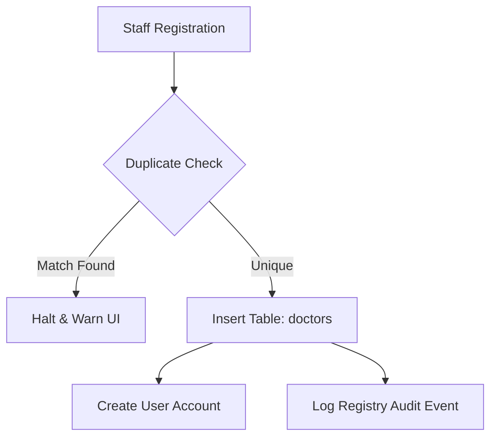
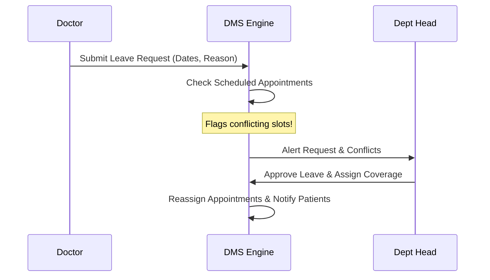

# Enterprise Engineering Specification: Phase 2C — Doctor Management System (DMS)

**Document Version:** v1.0  
**Author:** Chief Product Architect & Principal Software Engineer  
**Scope:** JEEVANOS Enterprise ERP Core

---

## Section 1: Executive Summary, Vision, & Scope

### 1.1 Executive Summary

The JeevanOS Doctor Management System (DMS) is the core operational module of the hospital enterprise suite. It governs clinician profiles, credentials, department structures, dynamic shift schedules, availability, leaves, and integration hooks for appointments, clinical consultations, prescriptions, and performance audits.

### 1.2 Product Vision

To establish a premium, Stripe-grade administrative and clinical workflow engine for medical professionals that minimizes overhead, prevents scheduling conflicts, logs structural audits, and exposes standardized APIs for patient care delivery.

### 1.3 Business Goals

- **Reduce Administrative Leakage:** Minimize operational downtime due to unscheduled clinician leaves or double-booked slots.
- **Credential Compliance:** Enforce automatic verification and notification triggers prior to medical license expirations.
- **Unified Integration:** Feed real-time availability states to Patient App appointments, Billing tables, and ward admissions.

### 1.4 Scope

- Single Source of Truth for Doctor Profiles (intake, qualifications, licenses).
- Primary and secondary department mapping.
- Multi-shift availability, holiday, and leave workflow engine.
- Performance dashboards and operational analytics.
- Secure digital signatures and prescription favorites templates.

### 1.5 Out of Scope

- Credentialing audits from external government boards (NMC) via API (to be handled in future phases).
- Direct payroll calculations (to be handled in the Billing/HR payroll module).

### 1.6 Success Metrics

| Metric                                  | Baseline          | Target (3 Months Post-Launch) |
| :-------------------------------------- | :---------------- | :---------------------------- |
| Scheduling conflict incidents           | ~4.5% of bookings | < 0.1%                        |
| Doctor profile registration time        | 45 minutes        | < 5 minutes                   |
| API Query Latency (availability checks) | 280ms             | < 45ms (using Redis/indexes)  |

---

## Section 2: User Personas

- **Hospital Administrator (Admin):** Focuses on compliance, system configurations, audits, and department head declarations.
- **Department Head (Clinical Lead):** Reviews clinical loads, reviews scheduling adjustments, and approves peer leaves.
- **Doctor (Practitioner):** Reviews upcoming queues, drafts clinical consultation records, signs prescriptions, and updates break preferences.
- **Receptionist (Scheduler):** Coordinates bookings, checks real-time slots, and checks queues.
- **Nurse (Clinical Assistant):** Admits patients to consultation rooms, collects vitals, and references doctor schedules.
- **HR Manager (Staff Coordinator):** Tracks attendance, processes contracts, checks documents, and archives retired doctors.
- **Patient:** Searches for specialists, books slots based on active timetables, and downloads signed documents.

---

## Section 3: User Stories

- **US-101 (HR Doctor Registry Intake):** As an HR Manager, I want to record a doctor's licensing numbers, digital signature, and profile photos in a multi-step form, so that the clinician's record is registered and compliant.
- **US-102 (Department Heads Mapping):** As a Hospital Admin, I want to map a doctor to a primary department and multiple secondary departments with corresponding roles, so that clinician schedules are segmented.
- **US-103 (Doctor Schedule Configuration):** As a Doctor, I want to set my daily active hours, break times, and weekend rotation choices, so that the patient booking app blocks off non-work hours.
- **US-104 (Leave Workflow & Coverage):** As a Department Head, I want to receive notifications when a doctor requests leave and view their scheduled appointments, so I can assign coverage before approving.
- **US-105 (Consultation Intake):** As a Doctor, I want to see a real-time waiting queue, open the active patient record, view emergency medical alerts, and type notes, so that the clinical transaction is logged.
- **US-106 (Prescription Templates):** As a Doctor, I want to insert favorite medicine templates and apply my encrypted digital signature, so that the pharmacy module immediately receives the order.
- **US-107 (Performance Metrics Auditing):** As a Department Head, I want to review comparative dashboards on patient volume, average visit duration, patient ratings, and billing billing metrics, to optimize staffing.

---

## Section 4: Doctor Registry

The registry provides a verified profile of every practitioner.



### 4.1 Registry Data Fields

- **Doctor ID:** Sequential enterprise identifier (e.g. `JOS-DOC-YYYY-XXXXX`).
- **Medical License Number:** Unique license number string (validated against regex schemas).
- **National Medical Council (NMC) Registration:** State registration code.
- **Specialization & Super Specialization:** Select list references (e.g., Cardiology, Electrophysiology).
- **Qualifications & Degrees:** Certified qualifications array (e.g., MD, DM, FACC).
- **Years of Experience:** Non-negative integer.
- **Consultation Fees:** Decimal field with currency tracking.
- **Photo & Encrypted Digital Signature:** Storage references pointing to the media bucket.
- **Employment Type:** `Full-Time`, `Part-Time`, `On-Call`, `Visiting Consultant`.
- **Registry Status:** `Active`, `Inactive`, `Suspended`, `On-Leave`, `Retired`.

---

## Section 5: Professional Profile

The profile is the public and clinical record of a practitioner.

- **Biography:** Rich-text biography outlining research focuses and clinical histories.
- **Education Timeline:** Chronological array containing institution, degree, and graduation year parameters.
- **Certifications:** Array of valid boards certifications (e.g. "Board Certified in Interventional Cardiology").
- **Research & Publications:** DOIs listing peer-reviewed journals.
- **Professional Memberships:** Associations mapping (e.g. "American Heart Association").
- **Verification Status:** Enum: `Draft`, `Pending_Review`, `Verified`, `Rejected`.

---

## Section 6: Department Mapping

To avoid siloed configurations, doctors can serve across multiple departments.

- **Primary Department:** The core department where the doctor is primary contracted (e.g. Cardiology). Controls default roster mapping.
- **Secondary Departments:** Array of secondary departments (e.g. Intensive Care, Emergency).
- **Departmental Roles:** Map corresponding roles (e.g. "Chief Consultant" in Cardiology, "Advising Specialist" in Intensive Care).

---

## Section 7: Availability Management

Controls clinical scheduling, slot durations, and booking limits.

- **Roster Configurations:** Day-of-week matrices mapping shift start, shift end, and interval durations (e.g. 15-minute slots).
- **Break Time Rules:** Locked intervals (e.g. 13:00 - 14:00) during which appointments are disabled.
- **Special Shift Rotations:** Night shift and weekend on-call mappings.
- **Holiday Calendars:** Integration with standard hospital holidays and customized doctor-specific leave days.

---

## Section 8: Leave Management

Supports leave scheduling and coverage management.



- **Apply Leave Form:** Renders date selections, leave category (Sabbatical, Emergency, Annual), and coverage assignment details.
- **Conflict Auditor:** Lists patient bookings that fall on requested dates.
- **Approve / Reject Action:** Updates database triggers, updates notifications, and automatically alerts scheduled patients.

---

## Section 9: Appointment Integration

A real-time sync between doctor calendars and scheduling queues.

- **Active Roster State:** Controls whether the slot booking widget displays availability.
- **Waiting Queue Dashboard:** Renders real-time statuses: `Waiting`, `In-Consultation`, `Completed`, `No-Show`.
- **Time Tracking:** Records check-in, consultation start, and consultation end times to track average visit durations.

---

## Section 10: Consultation Workflow

The workspace interface for doctors during patient exams.

```
+-----------------------------------------------------------------------------+
| CLINICAL CONSULTATION WORKSPACE                      Patient: John Doe (O-) |
+-----------------------------------------------------------------------------+
| MEDICAL ALERTS: [CRITICAL: RARE BLOOD O-]                                   |
|                                                                             |
| +-----------------------------+  +----------------------------------------+ |
| | Subjective Notes            |  | Prescriptions                          | |
| | [ Patient complains of ... ]|  | Template: [Adult Post-MI Cardiac]      | |
| +-----------------------------+  |                                        | |
| | Objective/Diagnosis         |  | Medications:                           | |
| | ICD-10: [ I21.9  ]          |  | 1. Aspirin 75mg -- 1-0-0 -- 30 Days    | |
| +-----------------------------+  | 2. Atorvastatin 40mg -- 0-0-1 -- 30 D  | |
| | Treatment Plan              |  +----------------------------------------+ |
| | [ Rest, follow-up ECG...  ] |  | [X] Apply Encrypted Digital Signature  | |
| +-----------------------------+  +----------------------------------------+ |
+-----------------------------------------------------------------------------+
```

- **Notes Input:** Structured sections for Subjective, Objective, Assessment, and Plan (SOAP notes).
- **ICD-10 Code Lookup:** Autocomplete search input mapping diagnostic codes.
- **Follow-up Planners:** Schedules return visits, automated laboratory panels, or radiology orders.

---

## Section 11: Prescription Integration

- **Digital Signature:** Cryptographically signs prescriptions. In development, logs a hash signature string; in production, uses client-side certificates.
- **Medicine Templates:** Saved combinations of drug classes, dosages, routes, and frequencies (e.g. "Cardiology Standard Dual Antiplatelet Template").
- **Favorites Registry:** Clinician-level quick-lists of frequently prescribed drugs.

---

## Section 12: Performance Dashboard

Renders KPI analytics for individual doctors.

- **Patients Seen Counter:** Aggregated daily, weekly, and monthly counts.
- **Revenue Generated:** Consultation billing fees and clinical procedures fees.
- **Average Consultation Duration:** Sum of visit times divided by total consultations.
- **Satisfaction Ratings:** Patient feedback ratings aggregation.

---

## Section 13: Analytics

Renders aggregate administrative reports.

- **Monthly Reports:** Volume trends, billing metrics, and clinic utilization metrics.
- **Department Performance Matrix:** Compares Cardiology vs Neurology vs Pediatrics volumes.
- **Doctor Comparison Index:** Analysis mapping wait-times against volume to identify bottlenecks.

---

## Section 14: Search & Filters

- **Specialist Global Search:** Natural language search mapping name, specialization, languages, or clinic location.
- **Advanced Filters:** Filter by availability, consultation fee limits, qualifications, and department structures.
- **Saved Searches:** HR templates (e.g. "On-Call Cardiac Surgeons").

---

## Section 15: Enterprise DataTable

- **Sorting:** Sort by Experience, Consultation Fee, Patient Volumes, or Rating.
- **Filtering:** Status filters (Active, On-Leave, Suspended) and Department filters.
- **Sticky Columns:** Doctor ID and Name columns remain sticky on horizontal scrolling.
- **Bulk Actions:** Batch status updates, CSV/Excel profile listings export, and directory printing layouts.

---

## Section 16: Enterprise Forms

- **Intake Form Stepper:** Form progression tabs: Personal Info -> Qualifications & Licensing -> Shift Rosters -> Digital Signatures.
- **Autosave Engine:** Serializes inputs to local storage to prevent session data loss on network drops.
- **Validation Wrapper:** FormValidationSummary mapping all fields (e.g. License regex).

---

## Section 17: Role Based Access Control (RBAC)

The following permission matrix governs all clinician data objects:

| Role               | View Profiles | Create Profiles | Update Schedules | Approve Leaves | View Fees/Revenue | Print Signatures |
| :----------------- | :------------ | :-------------- | :--------------- | :------------- | :---------------- | :--------------- |
| **Super Admin**    | Yes           | Yes             | Yes              | Yes            | Yes               | Yes              |
| **Hospital Admin** | Yes           | Yes             | Yes              | Yes            | Yes               | No               |
| **Dept Head**      | Yes           | No              | Yes (Dept)       | Yes (Dept)     | Yes (Dept)        | No               |
| **Doctor**         | Yes (Self)    | No              | Yes (Self)       | No             | Yes (Self)        | Yes (Self)       |
| **HR Manager**     | Yes           | Yes             | No               | No             | No                | No               |
| **Receptionist**   | Yes           | No              | No               | No             | No                | No               |
| **Nurse**          | Yes           | No              | No               | No             | No                | No               |

---

## Section 18: Audit Trail

Every state modification logs a record in `doctorAuditLogs`.

```json
{
  "auditLogId": 984512,
  "operatorUserId": 45,
  "operatorRole": "admin",
  "action": "UPDATE_SHIFT_ROSTER",
  "targetDoctorId": 12,
  "timestamp": "2026-07-04T18:04:12Z",
  "previousValue": { "tuesday": ["09:00-13:00"] },
  "newValue": { "tuesday": ["09:00-13:00", "14:00-18:00"] },
  "context": {
    "ipAddress": "192.168.1.104",
    "browser": "Chrome 122.0.0",
    "device": "Windows Desktop",
    "sessionId": "sess_88495a029c"
  }
}
```

---

## Section 19: Soft Delete & Archive Strategy

- **Soft Delete:** Doctors are never permanently deleted from tables. Setting `isDeleted = true` hides records from active registry searches and scheduler calendars.
- **Archive Policies:** If a doctor retires or resigns, their status transitions to `Archived`. The login account is deactivated, but clinical records remain for historical billing/patient tracking.
- **Permanent Deletions:** Restrictive authorization check (Super Admin only) to delete testing or mock database records.

---

## Section 20: Document Management

- **Supported Formats:** PDF, PNG, JPG, and WEBP.
- **Size Constraint:** Max file size of 10MB per document.
- **Documents Directory:** Categories for Medical Licenses, Board Certifications, Identity Documents, and Employment Contracts.

---

## Section 21: Media Storage Strategy

- **Storage Interface Class:** Unified `StorageProvider` interface abstraction.
- **Development Storage:** Local file system uploads directory (`/uploads/doctors/*`).
- **Production Storage:** S3-compatible cloud object storage integration (Railway Object Storage or Cloudflare R2).

---

## Section 22: Security

- **Signature Encryption:** Digital signatures are AES-256 encrypted at rest in the database.
- **Data Sanitization:** Strict HTML escaping on text biography inputs.
- **Rate Limiting:** tRPC availability and search queries are limited to 120 calls/minute per staff session to prevent indexing harvesting.

---

## Section 23: Performance

- ** Roster Memoization:** Memoize calendar slot checks using `useMemo` on the client.
- **Virtualization:** Virtualize the Doctor list when displaying >100 entries.
- **Indexed DB Queries:** Index the search parameters (`specialty`, `licenseNumber`, `departmentId`).

---

## Section 24: Accessibility

- **Screen Readers:** Complete ARIA labelling on availability calendars.
- **Keyboard Roster:** Navigate schedule slots via arrow keys and selection clicks.
- **Color Contrast:** Keep minimum contrast values of 4.5:1 (WCAG AA standard) for badge markers.

---

## Section 25: Responsive Design

- **Desktop/Laptop (>=1024px):** Grid dashboard with full SOAP note editor panels side-by-side with patient histories.
- **Tablet (768px - 1023px):** Collapsed sidebars, stacked demographics, scrollable schedule.
- **Mobile (<768px):** Stepper input lists, full-screen dialog overlay selectors.

---

## Section 26: Folder Structure

```
c:/hospital-management-system/
├── client/
│   └── src/
│       ├── components/
│       │   └── enterprise/
│       │       ├── DoctorIntakeForm.tsx       # Multi-step creation form
│       │       ├── AvailabilityRoster.tsx     # Calendar schedule configuration
│       │       └── ConsultationWorkspace.tsx  # SOAP note clinician panel
│       └── pages/
│           ├── DoctorManagement.tsx           # DataTable registry dashboard
│           └── DoctorProfile.tsx              # Public/Internal clinical profile
├── server/
│   ├── lib/
│   │   └── signature-crypto.ts                # AES-256 signature helpers
│   └── routers/
│       └── doctor.ts                          # Doctor TRPC endpoint mappings
└── drizzle/
    └── schema.ts                              # Drizzle doctors schemas
```

---

## Section 27: Reusable Component Architecture

- **DoctorCard:** Summarized information panel displaying status badge, specialization, fee, and availability metrics.
- **RosterCalendarGrid:** Weekly visual timetable builder with drag-to-define break times.
- **PrescriptionTemplateSelector:** Search and preview medication lists.

---

## Section 28: API Contracts (tRPC Definitions)

```typescript
import { z } from "zod";

export const doctorRouterDefinition = {
  create: "receptionistProcedure"
    .input(
      z.object({
        userId: z.number(),
        departmentId: z.number(),
        specialty: z.string().min(1),
        qualification: z.string().min(1),
        experience: z.number().nonnegative(),
        licenseNumber: z.string().min(1),
        profilePhoto: z.string().optional(),
        consultationFees: z.number().positive(),
        employmentType: z.enum([
          "Full-Time",
          "Part-Time",
          "On-Call",
          "Visiting Consultant",
        ]),
      })
    )
    .mutation(),

  updateRoster: "doctorProcedure"
    .input(
      z.object({
        doctorId: z.number(),
        schedule: z.record(z.array(z.string())), // JSON: { monday: ["09:00-13:00", "14:00-17:00"] }
      })
    )
    .mutation(),

  applyLeave: "doctorProcedure"
    .input(
      z.object({
        doctorId: z.number(),
        startDate: z.date(),
        endDate: z.date(),
        leaveType: z.enum(["Annual", "Sabbatical", "Medical", "Casual"]),
        reason: z.string().optional(),
        coveringDoctorId: z.number().optional(),
      })
    )
    .mutation(),

  getTimeline: "protectedProcedure"
    .input(z.object({ doctorId: z.number() }))
    .query(),

  list: "protectedProcedure"
    .input(
      z
        .object({
          departmentId: z.number().optional(),
          status: z
            .enum(["Active", "Inactive", "On-Leave", "Retired"])
            .optional(),
          specialty: z.string().optional(),
        })
        .optional()
    )
    .query(),
};
```

---

## Section 29: Database Schema

```typescript
import {
  int,
  mysqlEnum,
  mysqlTable,
  text,
  timestamp,
  varchar,
  decimal,
  boolean,
  json,
  foreignKey,
  index,
} from "drizzle-orm/mysql-core";
import { users, departments } from "./schema";

// DOCTORS REGISTRY SCHEMA
export const doctors = mysqlTable(
  "doctors",
  {
    id: int("id").autoincrement().primaryKey(),
    userId: int("userId").notNull().unique(),
    primaryDepartmentId: int("primaryDepartmentId").notNull(),
    secondaryDepartmentIds: json("secondaryDepartmentIds"), // Array of numbers
    specialty: varchar("specialty", { length: 150 }).notNull(),
    superSpecialty: varchar("superSpecialty", { length: 150 }),
    qualification: text("qualification").notNull(),
    degrees: json("degrees"), // Array of strings e.g. ["MD", "DM"]
    experience: int("experience").notNull(),
    consultationFees: decimal("consultationFees", {
      precision: 10,
      scale: 2,
    }).notNull(),
    profilePhoto: varchar("profilePhoto", { length: 500 }),
    encryptedSignature: text("encryptedSignature"),
    languagesSpoken: json("languagesSpoken"), // Array of strings
    emergencyContactName: varchar("emergencyContactName", { length: 255 }),
    emergencyContactPhone: varchar("emergencyContactPhone", { length: 50 }),
    employmentType: mysqlEnum("employmentType", [
      "Full-Time",
      "Part-Time",
      "On-Call",
      "Visiting Consultant",
    ])
      .default("Full-Time")
      .notNull(),
    status: mysqlEnum("status", [
      "Active",
      "Inactive",
      "Suspended",
      "On-Leave",
      "Retired",
    ])
      .default("Active")
      .notNull(),
    isAvailable: boolean("isAvailable").default(true).notNull(),

    // Soft Delete & Audit fields
    isDeleted: boolean("isDeleted").default(false).notNull(),
    deletedAt: timestamp("deletedAt"),
    deletedBy: int("deletedBy"),
    archivedAt: timestamp("archivedAt"),

    createdAt: timestamp("createdAt").defaultNow().notNull(),
    updatedAt: timestamp("updatedAt").defaultNow().onUpdateNow().notNull(),
  },
  table => [
    foreignKey({ columns: [table.userId], foreignColumns: [users.id] }),
    foreignKey({
      columns: [table.primaryDepartmentId],
      foreignColumns: [departments.id],
    }),
    index("idx_doctor_specialty").on(table.specialty),
    index("idx_doctor_status").on(table.status),
    index("idx_doctor_isDeleted").on(table.isDeleted),
  ]
);

// DOCTOR LEAVE MANAGEMENT
export const doctorLeaves = mysqlTable(
  "doctorLeaves",
  {
    id: int("id").autoincrement().primaryKey(),
    doctorId: int("doctorId").notNull(),
    startDate: timestamp("startDate").notNull(),
    endDate: timestamp("endDate").notNull(),
    leaveType: mysqlEnum("leaveType", [
      "Annual",
      "Sabbatical",
      "Medical",
      "Casual",
    ]).notNull(),
    reason: text("reason"),
    coveringDoctorId: int("coveringDoctorId"),
    status: mysqlEnum("status", ["Pending", "Approved", "Rejected"])
      .default("Pending")
      .notNull(),
    reviewedBy: int("reviewedBy"),
    reviewedAt: timestamp("reviewedAt"),
    createdAt: timestamp("createdAt").defaultNow().notNull(),
  },
  table => [
    foreignKey({ columns: [table.doctorId], foreignColumns: [doctors.id] }),
    index("idx_leave_dates").on(table.startDate, table.endDate),
  ]
);

// IMMUTABLE AUDIT LOG
export const doctorAuditLogs = mysqlTable("doctorAuditLogs", {
  id: int("id").autoincrement().primaryKey(),
  operatorId: int("operatorId").notNull(),
  action: varchar("action", { length: 100 }).notNull(),
  targetDoctorId: int("targetDoctorId").notNull(),
  previousValue: json("previousValue"),
  newValue: json("newValue"),
  ipAddress: varchar("ipAddress", { length: 45 }).notNull(),
  userAgent: varchar("userAgent", { length: 255 }).notNull(),
  createdAt: timestamp("createdAt").defaultNow().notNull(),
});
```

---

## Section 30: Validation Rules (Zod Schemas)

```typescript
import { z } from "zod";

export const doctorIntakeValidation = z.object({
  userId: z.number({ required_error: "User reference ID required" }),
  primaryDepartmentId: z.number({
    required_error: "Primary department is required",
  }),
  specialty: z.string().min(2, "Specialization must be at least 2 characters"),
  qualification: z.string().min(5, "Qualification list required"),
  experience: z.number().min(0, "Experience years cannot be negative"),
  consultationFees: z
    .number()
    .positive("Consultation fee must be greater than 0"),
  licenseNumber: z
    .string()
    .regex(
      /^[A-Z]{2,4}-\d{5,8}$/,
      "License number format must match e.g. MC-45921"
    ),
  emergencyContactPhone: z
    .string()
    .regex(/^\+?[1-9]\d{1,14}$/, "Valid E.164 emergency phone number required"),
});
```

---

## Section 31: Testing Strategy

### 31.1 Unit Tests

- **Soundex Check:** Test Soundex string conversions using edge-cases (silent vowels, special character strings, numeric values).
- **Roster Slot Generator:** Test that roster generator throws scheduling errors for overlapping break periods.

### 31.2 Integration Tests

- **tRPC Leave Conflicting Auditor:** Mock appointments on date ranges and verify that leave request mutation returns list of conflicts.
- **RBAC Enforcement:** Test that `receptionistProcedure` throws `TRPCError(UNAUTHORIZED)` when requesting custom revenue analytics.

### 31.3 E2E Tests

- Complete stepper form flow: input parameters, upload mock certificate, simulate collision block, override and verify new database index insertion.

---

## Section 32: Acceptance Criteria (Definition of Done)

- Standard columns (`isDeleted`, `status`, secondary departments) configured in DB.
- Complete validation schemas in tRPC routes.
- Registry page displays clinician listing utilizing the `DataTable`.
- Print view triggers correct 3.25" x 1" wristbands dimensions without sidebar pollution.
- All code compiles cleanly via `npm run check` and bundles via `npm run build`.

---

## Section 33: Git & Versioning Strategy

### 33.1 Version Alignment

The Doctor Management System matches the JeevanOS Design System v1.0 standard and operates on the baseline tag `ui-foundation-before-redesign`.

### 33.2 Rollback Strategy

If database migrations fail:

1. Revert schema definitions in Drizzle.
2. Run database rollback migrations via `npm run db:migrate`.
3. Reset branch pointers to previous git hashes.

---

## Section 34: Future Integration

- **AI Roster Assistant:** Natural language voice commands to block leave days and reassign appointments.
- **Telemedicine Video SDK:** Expose availability slots directly to video calling APIs.
- **Voice Dictation SOAP Notes:** Transcribe spoken audio recordings directly into structured SOAP note textareas.
